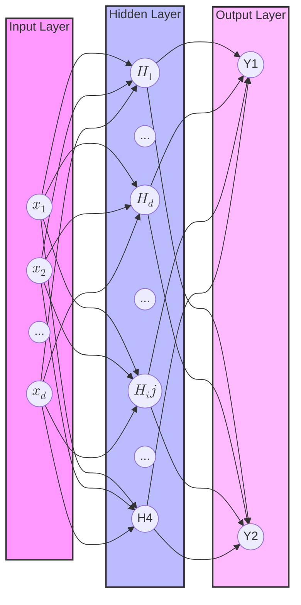

```mermaid
graph LR
    %% Direction: Left to Right
    
    %% Input Layer
    subgraph Input_Layer [Input Layer]
        I1(($$x_1$$))
        I2(($$x_2$$))
        I0((...))
        I3(($$x_d$$))
    end

    %% Hidden Layer
    subgraph Hidden_Layer [Hidden Layer]
        H1(($$H_1$$))
        H0((...))
        H2(($$H_d$$))
        H9((...))
        H3(($$H_ij$$))
        H8((...))
        H4((H4))
    end

    %% Output Layer
    subgraph Output_Layer [Output Layer]
        O1((Y1))
        O2((Y2))
    end

    %% Fully Connected Wiring
    I1 --> H1 & H2 & H3 & H4
    I2 --> H1 & H2 & H3 & H4
    I3 --> H1 & H2 & H3 & H4

    H1 --> O1 & O2
    H2 --> O1 & O2
    H3 --> O1 & O2
    H4 --> O1 & O2

    %% Custom Styling
    style Input_Layer fill:#f9f,stroke:#333,stroke-width:2px
    style Hidden_Layer fill:#bbf,stroke:#333,stroke-width:2px
    style Output_Layer fill:#fbf,stroke:#333,stroke-width:2px
```
